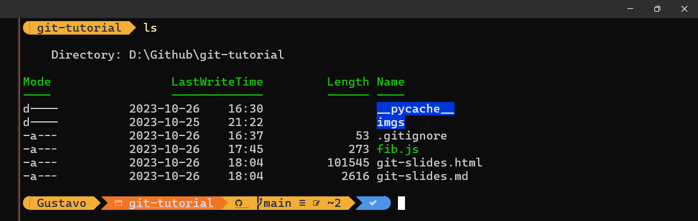

# TECH TALK

Gustavo Luchetti, 2023-10-27

---

## Sumário

- O que é **CLI**?
- Básico da **CLI do _git_**
- Usando **_git_** com **_Github_**
- Outras coisas...?

---

## Começando do início...

CLI - _Command-Line Interface_

A única interação que o usuário tem com o programa é por **texto**, no terminal.
Muito comuns em sistemas _Linux_ (mkdir, cat, grep, ssh, etc.), mas alguns programas do dia a dia do desenvolvedor também tem versões CLI (**github**, docker).



---

## Estrutura padrão

```bash
aprofunda -f analise.txt -o analise.pdf --verbose
```

- `aprofunda`: comando inicial, sempre o mesmo, indica pro terminal que programa você quer rodar.
- `-f, -o e --verbose`: argumentos adicionais que podem ou não receber parâmetros
- `analise.txt, analise.pdf`: parâmetros necessários

Rodar o aprofunda, recebendo como input um arquivo de texto, devolvendo um arquivo em PDF, explicitando os logs.

---

## Pra que usar CLI?

"Preciso fazer uma tarefa simples, e preciso fazer ela rápido"

- Modificar servidores (sem monitores disponíveis)
- Tarefas que precisam ser rodadas de forma bem específica (ou que exigem configurações específicas)
- **_Definição de infraestrutura e arquitetura (migração de banco de dados), coisas que precisam ser previsíveis e repitidas sem demorar muito tempo._**

A intenção NÃO é rejeitar _GUIs_, e sim explorar alternativas!

---

## Git

_Sistema de Controle de Versão Distribuído_
Feito em 2005 pelo criador do Linux!

- Gestão do código em diferentes estados/ambientes ('branches')
- Histórico muito granular
  (`git log, diff e blame`)
- Gerenciamento de mudanças (até no mesmo arquivo!)
- _Alteracão do passado?_
  (`git rebase`)


---

## Comandos Básicos

- `git init`: criação de um repositório vazio
- `git add`: adicionar arquivos no próximo commit
- `git commit`: definir um conjunto de mudanças como pronto pra ser enviado
- `git remote add`: definir branch 'remota' em algum repositório (no github, por exemplo)
- `git push`: empurrar mudanças para essa branch remota

---

## Git não é Github?

Github - Repositório de bases de código

- Avaliar qualidade de código (**Pull Request (PR)**)
- Automações de deploys
- Testes automatizados por ambiente

---

## Demonstração Git/Github

Vamos corrigir um arquivo javascript!

---

# Fim!
